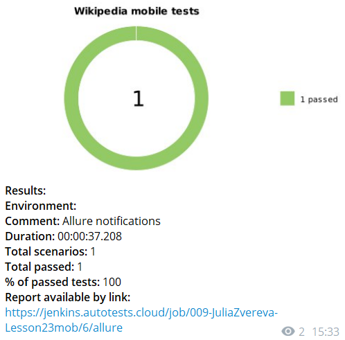

# Автотесты для мобильного Android приложения [Wikipedia](https://github.com/wikimedia/apps-android-wikipedia)
## Cписок проверок:

- [x] При старте приложения отображаются 4 экрана Getting started
- [x] Ненулевой результат выдачи при поиске

# Стек технологий

Автотесты написаны на <code>Java</code> с использованием фреймворков <code>Selenide</code> и <code>Appium</code>.
<code>BrowserStack</code> выполняет запуск приложения на удаленном мобильном Android-устройстве.
<code>Selenoid</code> выполняет запуск приложения на удаленном сервере в контейнерах <code>Docker</code>.
Для автоматизированной сборки проекта используется <code>Gradle</code>.
<code>Jenkins</code> выполняет запуск тестов. <code>Allure Report</code> формирует отчет о запуске тестов.
Автотесты интегрируются с тест-менеджмент системой <code>Allure TestOps</code> и таск-трекер системой <code>Jira</code>.
После завершения прогона отправляются уведомления с помощью бота в <code>Telegram</code>.

##### Пример готовой сборки Jenkins можно посмотреть [по ссылке](https://jenkins.autotests.cloud/job/009-JuliaZvereva-Lesson23mob/)

### Параметры запуска в Jenkins

### Статистика запусков в Jenkins

### Отчёт о прохождении автотестов в Allure Report

### Список автотестов в Allure Report

### Хранение тестовой документации в Allure TestOps

### Прохождение тестов в Allure TestOps

### Уведомления о прохождении автотестов в Telegram

### Интеграция тестов c таск-трекер системой Jira

